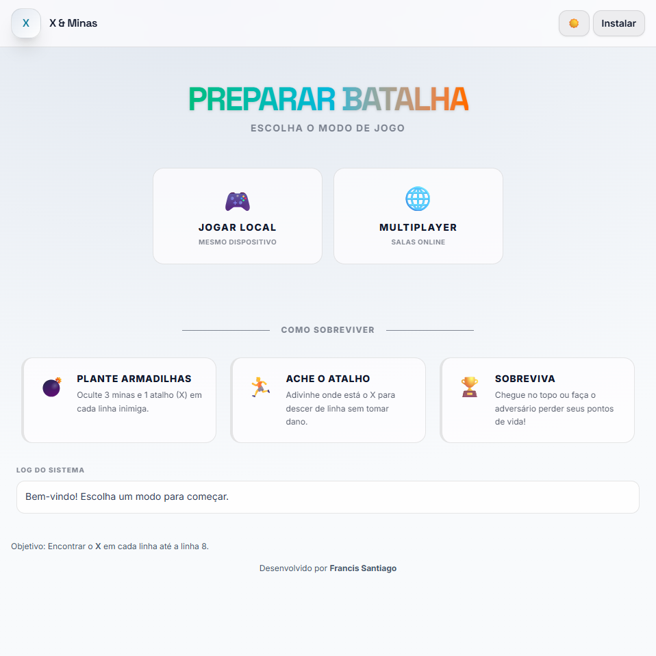

# X & Minas — Jogo Multiplayer (PWA)

Jogo de estratégia para 2 jogadores com **tabuleiro dinâmico** (colunas **A–H** e até **20 linhas**).  
Modos: **offline** (mesmo dispositivo), **LAN** (rede local) e **online** (WebSocket).



## Screenshots
Acesse as imagens em [screenshots/](screenshots/)

## Características

- **Configuração dinâmica**: defina linhas (2-20), minas por linha e dano por mina
- **Pontos de vida calculados**: automaticamente baseado na configuração (~60% de sobrevivência)
- **Lobbies separados**: interface padronizada para modo local e online
- **Nome persistente**: salvo no localStorage para todas as partidas
- **PWA**: instale no celular/PC e jogue offline ou online
- **Design moderno**: Tailwind CSS v4 com tema claro/escuro

## Regras

### Objetivo

**Encontrar o "X" de cada linha**, em ordem crescente, até chegar à última linha.

### Fase de Preparação (Setup)

Antes da partida começar, cada jogador configura **secretamente** as armadilhas para o oponente:

- **Minas**: quantidade configurável por linha (padrão: 3)
- **X**: 1 atalho por linha → ao oponente encontrar, avança para próxima linha

> Dica: use **"Tudo Aleatório"** para gerar posições automaticamente.

### Durante a Partida

- **Turnos alternados**: escolha uma coluna na sua linha atual
- **Se achar X**: avança 1 linha automaticamente
- **Se cair em mina**: perde pontos de vida (dano configurável, máx. -5)
- **Se não achar nada**: permanece na mesma linha

### Fim de Jogo

Vence quem:

- Encontra o **X da última linha** primeiro, **ou**
- Elimina o oponente (zera os pontos de vida)

## Como Jogar

### Modo Offline (mesmo dispositivo)

1. Clique em **"🎮 Jogar Local"** no menu
2. No Lobby Local, defina os nomes dos jogadores
3. Configure a partida: linhas, minas/linha, dano/mina
4. Clique **"Iniciar Partida"**
5. Cada jogador configura as armadilhas do oponente (fase de setup)
6. A partida começa automaticamente

### Modo Online/LAN

1. Clique em **"🌐 Multiplayer"** no menu
2. No Lobby Online, defina seu nome
3. Configure a partida (anfitrião define as regras)
4. **Criar sala**: gere um código e compartilhe com o amigo
5. **Entrar em sala**: digite o código recebido
6. Ambos configuram as armadilhas
7. A partida inicia quando ambos terminarem o setup

> **LAN**: use o IP da máquina host (ex: `http://192.168.0.10:3000`)

## Rodar Localmente

### Produção (LAN/Online)

```bash
npm install
npm run build
npm start
```

Acesse: `http://localhost:3000`

### Desenvolvimento (hot reload)

```bash
npm install
npm run dev
```

- Frontend: `http://localhost:5173`
- Backend WebSocket: `http://localhost:3000`

> Para testar em outro dispositivo na LAN: `http://IP_DO_HOST:5173`

## GitHub Pages

O frontend pode ser hospedado no GitHub Pages:

- Workflow: `.github/workflows/deploy-pages.yml`
- Comando: `npm run build:pages`

> ⚠️ O modo **Offline** funciona completamente no GitHub Pages.  
> O modo **Online** requer um servidor Node.js rodando separadamente (VPS, Render, Fly.io, etc.).

## Configurações da Partida

No lobby (local ou online), você pode configurar:

| Opção       | Padrão | Mínimo | Máximo         |
| ----------- | ------ | ------ | -------------- |
| Linhas      | 8      | 2      | 20             |
| Minas/Linha | 3      | 1      | Colunas-1 (7)  |
| Dano/Mina   | 1      | 1      | 5              |

**Cálculo de HP**: `max(10, ceil(linhas × minas × dano × 0.6))`

## Controles do Setup

| Ação              | PC                       | Mobile                |
| ----------------- | ------------------------ | --------------------- |
| Marcar mina       | Clique esquerdo          | Toque                 |
| Definir X         | Clique direito ou botões | Toque longo ou botões |
| Aleatório (linha) | Botão 🎲                 | Botão 🎲              |
| Aleatório (tudo)  | Botão 🎲                 | Botão 🎲              |

## Tecnologias

- **Frontend**: TypeScript + Vite + Tailwind CSS v4
- **Backend**: Node.js + WebSocket (ws)
- **Estilos**: Tailwind com `@theme` e `@apply`
- **Fontes**: Inter + Space Grotesk (Google Fonts)
- **PWA**: Manifest + Service Worker

## Estrutura do Projeto

```
mina-web/
├── src/
│   ├── app.ts          # Lógica do jogo (cliente)
│   ├── styles.css      # Tailwind v4 + custom styles
│   └── sw.ts           # Service Worker
├── server.ts           # Servidor WebSocket
├── index.html          # Entry point
├── screenshots/        # Screenshots para README/PWA
└── dist/               # Build de produção
```

## Licença

Desenvolvido por [Francis Santiago](https://francis-santiago.lightburden.net/)
